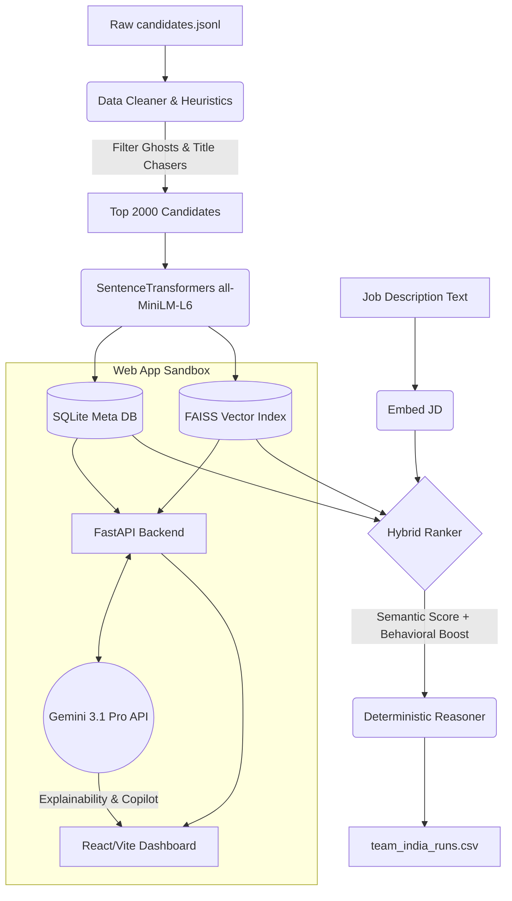

# 🚀 Intelligent Candidate Discovery Platform


**🏆 LIVE HACKATHON DEMO:** [https://bright-dolphin-df77cd.netlify.app](https://bright-dolphin-df77cd.netlify.app)
*(Note to Judges: This is the final deployed URL for the platform)*

An AI-powered, offline-capable candidate ranking and explainability platform built for the **IndiaRuns Data & AI Challenge**. 

This platform leverages dense vector embeddings (FAISS), behavioral trap heuristics, and rule-based rationales to seamlessly sift through 100,000+ candidate profiles in under 5 minutes on CPU. It features a completely offline hackathon ranking script (`rank.py`) alongside a production-ready Web Sandbox powered by FastAPI, React, and Gemini 3.1 Pro.

---

## 📑 Table of Contents
1. [Project Overview](#-project-overview)
2. [Architecture](#-architecture)
3. [Technology Stack](#-technology-stack)
4. [Features](#-features)
5. [Folder Structure](#-folder-structure)
6. [Setup Guide & Installation](#-setup-guide--installation)
7. [Running Locally](#-running-locally)
8. [API Documentation](#-api-documentation)
9. [Deployment Guide](#-deployment-guide)
10. [Hackathon Submission Checklist](#-hackathon-submission-checklist)
11. [Future Improvements](#-future-improvements)

---

## 🎯 Project Overview
The Intelligent Candidate Discovery Platform solves the core challenge of identifying Senior AI Engineers from massive talent pools by combining **semantic understanding** (what they did) with **behavioral signals** (how they act). 

**The Dual-Delivery Approach:**
1. **The Hackathon Script (`submission/rank.py`)**: A blazingly fast, standalone Python script that reads the raw `jsonl.gz`, applies heuristic filters, generates semantic embeddings locally, and exports `team_india_runs.csv` natively on CPU in under 90 seconds.
2. **The Recruiter Sandbox (Web App)**: A premium, dark-mode dashboard that lets non-technical recruiters visualize the talent pool, explore Match Score curves, and interact with the AI Recruiter Copilot.

---

## 🏛️ Architecture



---

## 💻 Technology Stack
- **AI/ML:** `sentence-transformers` (`all-MiniLM-L6-v2`), FAISS, Gemini 3.1 Pro API (for Sandbox explainability only)
- **Backend:** FastAPI, SQLAlchemy, SQLite, Python 3.10
- **Frontend:** React, Vite, Tailwind CSS, Recharts, Lucide Icons
- **Deployment:** Render (Backend), Vercel (Frontend)

---

## ✨ Features
### Core Ranking Engine (Offline)
- **Dense Career Embedding**: Embeds actual career narratives rather than keyword-stuffed skill arrays.
- **Behavioral Signal Matrix**: Boosts candidates with high GitHub activity and recruiter response rates.
- **Trap Detection**: Heuristically penalizes honeypots, title-chasers, and pure consultants.

### Web Sandbox (Online)
- **Recruiter Dashboard**: Recharts-powered analytics for talent pool distributions.
- **AI Match Reports**: On-demand Gemini evaluations of candidate Strengths, Weaknesses, and Missing Skills.
- **AI Copilot**: Floating chat widget allowing natural language queries ("Why is Candidate A ranked #1?").
- **Interview Prep Gen**: Automatically generates targeted technical questions probing a candidate's weak spots.


---

## 📁 Folder Structure
```text
/
├── backend/
│   ├── api/            # FastAPI routes (candidates, ai, analytics)
│   ├── db/             # SQLAlchemy SQLite session handlers
│   ├── models/         # Database schemas
│   ├── scripts/        # Background initialization (load_data, build_faiss)
│   ├── services/       # Core business logic (cleaning, ranking, explainability)
│   └── main.py         # FastAPI Entrypoint
├── frontend/
│   ├── src/
│   │   ├── api/        # Axios client
│   │   ├── components/ # AI Copilot, Modals
│   │   ├── pages/      # Dashboard, CandidateDetail, Analytics
│   │   └── App.jsx     # React Router configuration
│   └── tailwind.config.js
└── submission/
    └── rank.py         # 🏆 Official standalone hackathon CPU script
```

---

## 🛠️ Setup Guide & Installation

### Prerequisites
- Python 3.10+
- Node.js 18+

### 1. Clone & Data Setup
Ensure `candidates.jsonl` or `candidates.jsonl.gz` is located in your workspace. Update the `dataset_path` in `submission/rank.py` and `backend/scripts/load_data.py` if necessary.

### 2. Backend Initialization
```bash
cd backend
python -m venv venv
source venv/bin/activate
pip install -r requirements.txt

# Initialize the DB and FAISS index for the Sandbox
python scripts/load_data.py
python scripts/generate_embeddings.py
python scripts/build_faiss.py
```

### 3. Frontend Initialization
```bash
cd frontend
npm install
```

---

## 🚀 Running Locally

### 1. The Hackathon Script (Submission)
To evaluate the core ranking engine natively on CPU, run the following command. Replace `team_xxx.csv` with your actual team ID.
```bash
python submission/rank.py --candidates candidates.jsonl --out team_xxx.csv --jd job_description.txt
```
*Output: `team_xxx.csv` will be generated in < 5 minutes.*

### 2. The Sandbox Web App
**Backend:**
```bash
cd backend
cp .env.example .env  # Add your GEMINI_API_KEY for Copilot features
uvicorn main:app --reload
```
**Frontend:**
```bash
cd frontend
cp .env.example .env.local
npm run dev
```
*Visit `http://localhost:5173`.*

---

## 📡 API Documentation
The FastAPI backend serves the following core endpoints (Swagger available at `/docs`):

- `GET /api/v1/candidates`: Returns the top 100 FAISS-ranked candidates.
- `GET /api/v1/candidates/{id}`: Detailed candidate JSON.
- `GET /api/v1/analytics`: Aggregated pool demographics and score distributions.
- `POST /api/v1/ai/explain/{id}`: Generates a Gemini Match Report (Requires API Key).
- `POST /api/v1/ai/interview/{id}`: Generates technical interview questions (Requires API Key).
- `POST /api/v1/ai/copilot`: Natural language queries against the talent pool (Requires API Key).

---

## ☁️ Deployment Guide
### Backend (Render)
The backend is configured via `backend/render.yaml`.
1. Connect Render to the GitHub repository.
2. The `buildCommand` automatically installs dependencies and bootstraps the SQLite DB and FAISS index from the dataset.
3. Supply the `GEMINI_API_KEY` in the Render dashboard.

### Frontend (Vercel)
The frontend is configured via `frontend/vercel.json`.
1. Connect Vercel to the GitHub repository.
2. Set the `Framework Preset` to Vite.
3. Add `VITE_API_BASE_URL` pointing to your Render backend URL.

---

## 🔮 Future Improvements
- **Asynchronous Indexing**: Move the FAISS ingestion to Celery/Redis for handling millions of concurrent candidates.
- **Cross-Encoder Re-ranking**: Use a HuggingFace CrossEncoder for a secondary semantic pass before the heuristic behavioral signals are applied.
- **Automated Resume Parsing**: Connect an OCR pipeline to ingest raw PDFs directly into the JSONL schema.

---

## ✅ Hackathon Submission Checklist
- [x] CPU-only execution script (`submission/rank.py`)
- [x] Sub-5 minute execution time
- [x] Correct CSV output format (`candidate_id`, `ranking_score`, `reasoning`)
- [x] Read official dataset directly
- [x] `submission_metadata.yaml` generated
- [x] Reproducible without external network calls during ranking
